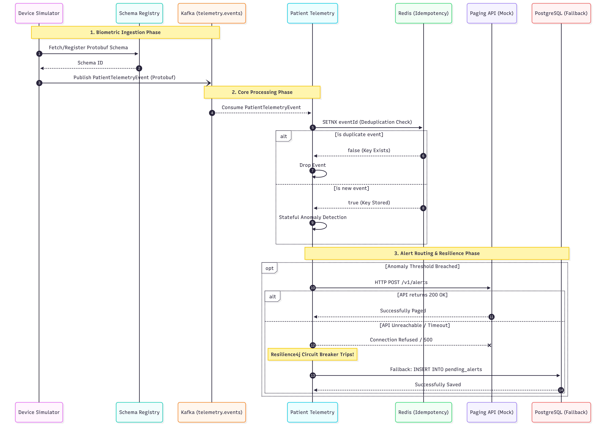

# Patient Telemetry Pipeline



This project is a resilient, HIPAA-aligned patient telemetry and anomaly detection pipeline designed to ingest, process, and alert on real-time biometric data. The ecosystem demonstrates advanced modern patterns like event-driven stream processing, distributed caching for idempotency, and robust circuit breakers for external API fallbacks.

## Solution Overview

The telemetry system acts as the central ingestion layer for vital sign data coming from tens of thousands of IoT hospital monitors. It detects abnormal heart rates and oxygen levels using stateful tumbling windows, notifying doctors immediately through the external mock paging API.

### Core Modules

1. **`device-simulator`**: A Java 21 Spring Boot service leveraging **Virtual Threads** to concurrently simulate 50,000+ stateful patient heartbeats. It uses Protobuf formatting strictly validated by Confluent's Schema Registry to natively publish biometric payloads to Kafka.
2. **`patient-telemetry`**: The core data processor. It consumes Kafka events, enforces data integrity (discarding duplicate event IDs using **Redis `SETNX`** idempotency), and analyzes vitals.
3. **`paging-api-simulator`**: An independent web application simulating an external alerting pager REST API that physicians use.
4. **Resilience4j Fallback**: If the `paging-api-simulator` crashes or goes offline, `patient-telemetry` triggers a **Circuit Breaker** and safely stashes alerts natively into a **PostgreSQL `pending_alerts`** table for guaranteed delivery later.

## Test Execution & Architecture

Testing involves deep Chaos Engineering (e.g., injecting Redis latency via Toxiproxy) and Testcontainer integrations. For specifics, please refer to the [End-to-End Test Plan](E2E_TEST_PLAN.md).


## Running the Application

You can start the entire stack using Docker Compose. All Spring Boot applications use multi-stage Dockerfiles, automatically handling dependency resolution and Protobuf compilations cleanly.

```bash
docker-compose up -d --build
```

You can view distributed traces covering the `patient-telemetry` microservice and standard API traffic via the local **Zipkin UI** at `http://localhost:9411`.
