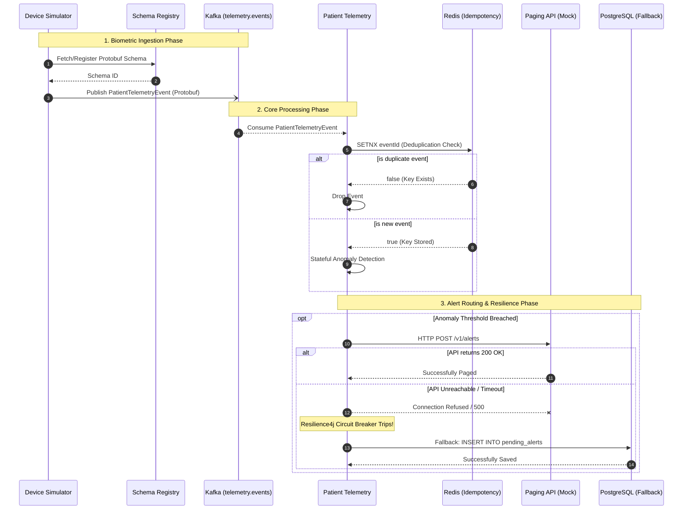

# System Sequence Diagram

This diagram visualizes the end-to-end data flow between the microservices, databases, and message brokers within the telemetry ecosystem. It also maps the circuit-breaker resilience pathway when external services fail.

